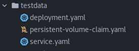
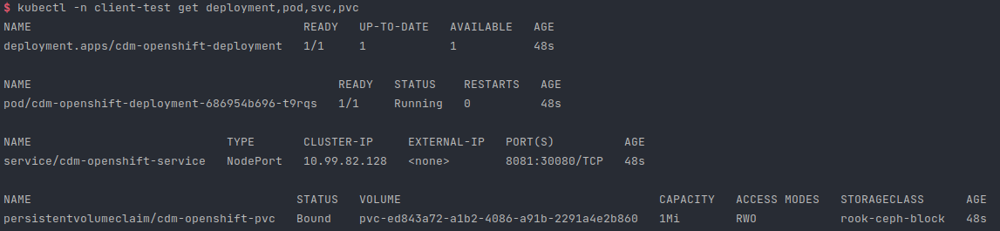
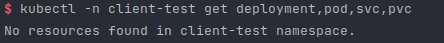

# Client
v0.1

## client is a package for test
### example
##### Create workload and Client
```go
// File path and yaml files
const (
    TestFilePath = "testdata"
    Deployment   = "deployment.yaml"
    Pvc          = "persistent-volume-claim.yaml"
    Service      = "service.yaml"
)

// Create client
c := client.NewClient()

// Get yaml files for workload
f := client.GetTestFileListToBytes(TestFilePath, Pvc, Deployment, Service)

// Create workload object
newWorkload := client.NewWorkload("client-test", f)

// Add workload to client
c.AddWorkload(newWorkload)
```
##### Apply workload
```go
// Apply workload
c.ApplyWorkload("client-test")
```
##### Delete workload
```go
// Delete workload
c.DeleteWorkload("client-test")
```
##### Screen shot


